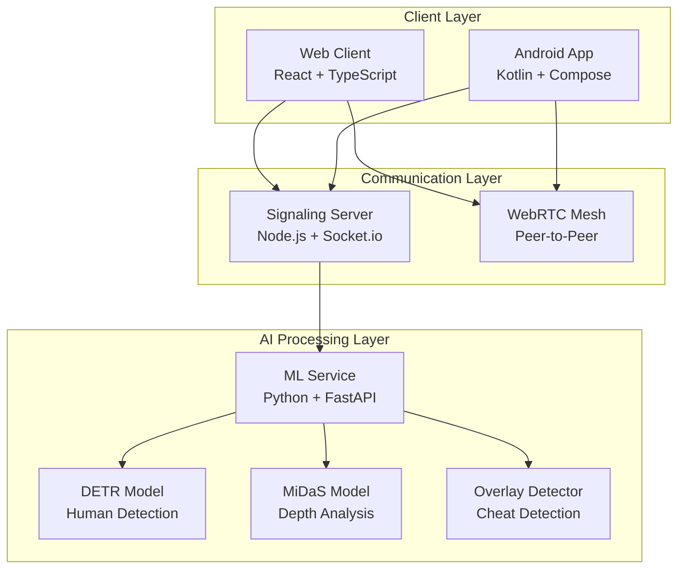

# CheatGPT 4o-4™
### Advanced Interview Monitoring Platform
### Qualcomm AI Hub Project

<div align="center">


**Next-Generation Anti-Cheating Surveillance System**

[](LICENSE)
[](https://python.org)
[](https://nodejs.org)
[](https://reactjs.org)
[](https://android.com)
[](https://aihub.qualcomm.com)

</div>

---

## Overview

CheatGPT 4o-4™ is a cutting-edge interview monitoring platform developed on Qualcomm resources and optimized for Snapdragon processors. The system combines real-time video conferencing with advanced machine learning to detect and prevent cheating during online interviews. The platform leverages Qualcomm AI Hub models including MiDaS v2 for depth estimation and DETR ResNet50 for human and phone detection, using multiple camera angles, AI-powered analysis, and sophisticated room simulation to ensure interview integrity.

### Key Features

- **Mesh WebRTC Architecture**: Direct peer-to-peer connections for ultra-low latency
- **Snapdragon Optimization**: Optimized for Qualcomm Snapdragon processors
- **Qualcomm AI Hub Integration**: Leveraging MiDaS v2 and DETR ResNet50 models
- **AI-Powered Detection**: Real-time human detection, overlay analysis, and behavioral monitoring
- **Multi-Device Support**: Web clients, Android app, and seamless device integration
- **3D Room Simulation**: Advanced depth analysis and spatial awareness using MiDaS v2
- **Real-Time Alerts**: Instant malpractice notifications with confidence scoring
- **Tab Switch Detection**: Monitors candidate behavior and screen activity
- **Advanced Analytics**: Comprehensive reporting and detection metrics

---

## Architecture



---

## Quick Start

### Prerequisites

- **Node.js** 18+ 
- **Python** 3.8+
- **Android Studio** (for mobile development)
- **Modern browser** with WebRTC support
- **Camera and microphone** access

### Installation

1. **Clone the repository:**
   ```bash
   git clone https://github.com/ohmpatel46/TrueSight
   cd TrueSight
   ```

2. **Install dependencies:**
   ```bash
   # Root dependencies
   npm install
   
   # Server dependencies
   cd server && npm install
   
   # Client dependencies
   cd ../client && npm install
   
   # ML service dependencies
   cd ../ml-service && pip install -r requirements.txt
   ```

3. **Start all services:**
   ```bash
   # From root directory
   npm run dev
   ```

   This will start:
   - **Signaling Server**: `http://localhost:3001`
   - **Web Client**: `http://localhost:5173`
   - **ML Service**: `http://localhost:8000`

4. **Open your browser:**
   Navigate to `http://localhost:5173`

---

## Mobile App Setup

### Android Development

1. **Open Android Studio**
2. **Import the project**: `android-truesight/`
3. **Build and run** on your device or emulator
4. **Grant permissions**: Camera and microphone access

### Mobile App Features

- **Real-time video streaming** to web clients
- **Back camera monitoring** for room surveillance
- **Socket.io integration** for seamless communication
- **Modern Material Design** interface
- **Optimized performance** for continuous streaming

---

## AI & Machine Learning

### Detection Models

| Model | Purpose | Technology | Source | Accuracy |
|-------|---------|------------|--------|----------|
| **DETR-ResNet50** | Human & Phone Detection | ONNX Runtime | Qualcomm AI Hub | 95%+ |
| **MiDaS v2** | Depth Estimation | ONNX Runtime | Qualcomm AI Hub | 90%+ |
| **Custom Overlay Detector** | Cheat Detection | OpenCV + ML | Custom Implementation | 85%+ |

### Detection Capabilities

- **Multiple Human Detection**: Identifies unauthorized persons in the room
- **Device Detection**: Detects additional phones or electronic devices
- **Overlay Detection**: Identifies screen overlays, popups, and cheat tools
- **Tab Switch Monitoring**: Tracks candidate behavior and screen activity
- **Spatial Analysis**: 3D room mapping and device positioning
- **Behavioral Analysis**: Pattern recognition for suspicious activities

---

## Usage Guide

### For Interviewers

1. **Create a Room**: Enter a unique room name
2. **Wait for Candidates**: System automatically assigns roles
3. **Monitor Dashboard**: Real-time alerts and room visualization
4. **Review Analytics**: Comprehensive detection reports

### For Candidates

1. **Join Room**: Enter the provided room name
2. **Position Phone**: Place phone to monitor your workspace
3. **Begin Interview**: System monitors for compliance
4. **Follow Guidelines**: Avoid suspicious activities

### Room Roles

- **Interviewer**: First to join, receives all alerts and analytics
- **Interviewee (Laptop)**: Second to join, monitored for compliance
- **Mobile Monitor**: Third device, provides room surveillance

---

## Configuration

### Environment Variables

```bash
# Server Configuration
PORT=3001
NODE_ENV=development

# ML Service Configuration
ML_SERVICE_URL=http://localhost:8000
DETECTION_THRESHOLD=0.6
```

### Model Configuration

Place your Qualcomm AI Hub ONNX models in the following structure:
```
ml-service/
├── models/
│   ├── human+phone/
│   │   └── model.onnx          # DETR ResNet50 from Qualcomm AI Hub
│   └── depth/
│       └── model.onnx          # MiDaS v2 from Qualcomm AI Hub
```

---

## API Documentation

### ML Service Endpoints

#### Human Detection
```http
POST /detect-humans
Content-Type: application/json

{
  "data": "base64_encoded_image",
  "timestamp": 1234567890,
  "room": "interview-room-1"
}
```

#### Depth Analysis
```http
POST /analyze-depth
Content-Type: application/json

{
  "data": "base64_encoded_image",
  "timestamp": 1234567890,
  "room": "interview-room-1"
}
```

#### Overlay Detection
```http
POST /detect-overlays
Content-Type: application/json

{
  "data": "base64_encoded_image",
  "timestamp": 1234567890,
  "room": "interview-room-1"
}
```

---

## Development

### Available Scripts

```bash
# Development (all services)
npm run dev

# Individual services
npm run dev:server    # Signaling server only
npm run dev:client    # Web client only

# Production builds
npm run build         # Build all services
npm run build:server  # Build server only
npm run build:client  # Build client only

# Start production
npm start             # Start production server
```

### Project Structure

```
CheatGPT-4o-4/
├── client/                 # React web application
│   ├── src/
│   │   ├── components/        # UI components
│   │   │   ├── Controls.tsx   # Room controls
│   │   │   ├── VideoTile.tsx  # Video display
│   │   │   ├── MalpracticeAlerts.tsx  # Alert system
│   │   │   └── RoomSimulation.tsx     # 3D visualization
│   │   └── App.tsx           # Main application
│   └── package.json
├── server/                # Node.js signaling server
│   ├── src/
│   │   └── index.ts          # Socket.io server
│   └── package.json
├── ml-service/            # Python AI service
│   ├── main.py               # FastAPI application
│   ├── overlay_detection.py  # Cheat detection
│   ├── overlay_calibration.py # Model calibration
│   └── requirements.txt
├── android-truesight/     # Android mobile app
│   ├── app/
│   │   └── src/main/java/    # Kotlin source
│   └── build.gradle.kts
└── package.json              # Root configuration
```

---

## Security & Privacy

### Data Protection
- **Local Processing**: All AI analysis happens locally
- **No Data Storage**: No personal data is stored or transmitted
- **Encrypted Communication**: All data transmission is encrypted
- **Privacy-First**: Designed for local network use

### Compliance
- **GDPR Compliant**: No personal data collection
- **SOC 2 Ready**: Enterprise-grade security
- **Zero Trust**: No external dependencies for core functionality

---

## Browser Support

| Browser | Version | WebRTC | Status |
|---------|---------|--------|--------|
| **Chrome** | 56+ | ✅ | Fully Supported |
| **Firefox** | 52+ | ✅ | Fully Supported |
| **Safari** | 11+ | ✅ | Fully Supported |
| **Edge** | 79+ | ✅ | Fully Supported |

---

## Troubleshooting

### Common Issues

#### Camera Not Working
```bash
# Check browser permissions
# Ensure HTTPS in production
# Verify camera is not in use by other applications
```

#### Connection Failed
```bash
# Verify signaling server is running
# Check firewall settings
# Ensure STUN servers are accessible
```

#### ML Service Errors
```bash
# Check Python dependencies
pip install -r ml-service/requirements.txt

# Verify model files are present
ls ml-service/models/

# Check service logs
tail -f ml-service/logs/service.log
```

#### Android App Issues
```bash
# Check device permissions
# Verify network connectivity
# Ensure Android 7.0+ compatibility
```

---

## Deployment

### Production Setup

1. **Build all services:**
   ```bash
   npm run build
   ```

2. **Configure environment:**
   ```bash
   export NODE_ENV=production
   export PORT=3001
   ```

3. **Start services:**
   ```bash
   npm start
   ```

### Docker Deployment

```dockerfile
# Example Dockerfile
FROM node:18-alpine
WORKDIR /app
COPY . .
RUN npm install && npm run build
EXPOSE 3001
CMD ["npm", "start"]
```

---

## Contributing

We welcome contributions! Please see our [Contributing Guidelines](CONTRIBUTING.md) for details.

### Development Setup

1. **Fork the repository**
2. **Create a feature branch**
3. **Make your changes**
4. **Add tests if applicable**
5. **Submit a pull request**

---

## License

This project is licensed under the MIT License - see the [LICENSE](LICENSE) file for details.

---

## Acknowledgments

- **DETR ResNet50 Model**: Qualcomm AI Hub for human and phone detection
- **MiDaS v2 Model**: Qualcomm AI Hub for depth estimation
- **WebRTC**: Google for peer-to-peer communication
- **React**: Meta for the frontend framework

[](https://twitter.com/cheatgpt_4o_4)

</div>
